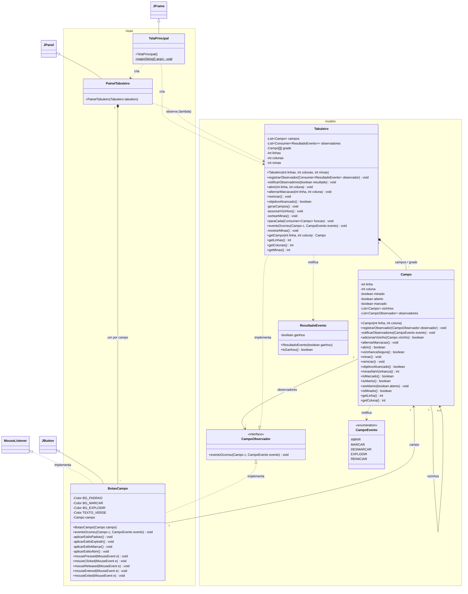

# Diagrama de classes — Campo Minado

```mermaid
classDiagram
    direction TB

    namespace modelo {
        class Tabuleiro {
            -List~Campo~ campos
            -List~Consumer~ResultadoEvento~~ observadores
            -Campo[][] grade
            -int linhas
            -int colunas
            -int minas
            +Tabuleiro(int linhas, int colunas, int minas)
            +registrarObservador(Consumer~ResultadoEvento~ observador) void
            -notificarObservadores(boolean resultado) void
            +abrir(int linha, int coluna) void
            +alternarMarcacao(int linha, int coluna) void
            +reiniciar() void
            +objetivoAlcancado() boolean
            -gerarCampos() void
            -associarVizinhos() void
            -sortearMinas() void
            +paraCada(Consumer~Campo~ funcao) void
            +eventoOcorreu(Campo c, CampoEvento evento) void
            -mostrarMinas() void
            +getCampo(int linha, int coluna) Campo
            +getLinhas() int
            +getColunas() int
            +getMinas() int
        }

        class Campo {
            -int linha
            -int coluna
            -boolean minado
            -boolean aberto
            -boolean marcado
            -List~Campo~ vizinhos
            -List~CampoObservador~ observadores
            +Campo(int linha, int coluna)
            +registrarObservador(CampoObservador observador) void
            -notificarObservadores(CampoEvento evento) void
            +adicionarVizinho(Campo vizinho) boolean
            +alternarMarcacao() void
            +abrir() boolean
            +vizinhancaSegura() boolean
            +minar() void
            +reiniciar() void
            +objetivoAlcancado() boolean
            +minasNaVizinhanca() int
            +isMarcado() boolean
            +isAberto() boolean
            +setAberto(boolean aberto) void
            +isMinado() boolean
            +getLinha() int
            +getColuna() int
        }

        class CampoObservador {
            <<interface>>
            +eventoOcorreu(Campo c, CampoEvento evento) void
        }

        class CampoEvento {
            <<enumeration>>
            ABRIR
            MARCAR
            DESMARCAR
            EXPLODIR
            REINICIAR
        }

        class ResultadoEvento {
            -boolean ganhou
            +ResultadoEvento(boolean ganhou)
            +isGanhou() boolean
        }
    }

    namespace visao {
        class TelaPrincipal {
            +TelaPrincipal()
            +main(String[] args)$ void
        }

        class PainelTabuleiro {
            +PainelTabuleiro(Tabuleiro tabuleiro)
        }

        class BotaoCampo {
            -Color BG_PADRAO
            -Color BG_MARCAR
            -Color BG_EXPLODIR
            -Color TEXTO_VERDE
            -Campo campo
            +BotaoCampo(Campo campo)
            +eventoOcorreu(Campo c, CampoEvento evento) void
            -aplicarEstiloPadrao() void
            -aplicarEstiloExplodir() void
            -aplicarEstiloMarcar() void
            -aplicarEstiloAbrir() void
            +mousePressed(MouseEvent e) void
            +mouseClicked(MouseEvent e) void
            +mouseReleased(MouseEvent e) void
            +mouseEntered(MouseEvent e) void
            +mouseExited(MouseEvent e) void
        }
    }

    CampoObservador <|.. Tabuleiro : implementa
    CampoObservador <|.. BotaoCampo : implementa
    MouseListener <|.. BotaoCampo : implementa
    JFrame <|-- TelaPrincipal
    JPanel <|-- PainelTabuleiro
    JButton <|-- BotaoCampo

    Tabuleiro "1" *-- "*" Campo : campos / grade
    Campo "1" --> "0..8" Campo : vizinhos
    Campo "1" --> "*" CampoObservador : observadores
    Campo ..> CampoEvento : notifica
    Tabuleiro ..> ResultadoEvento : notifica

    TelaPrincipal ..> Tabuleiro : cria
    TelaPrincipal ..> PainelTabuleiro : cria
    PainelTabuleiro "1" *-- "*" BotaoCampo : um por campo
    PainelTabuleiro ..> Tabuleiro : observa (lambda)
    BotaoCampo "1" --> "1" Campo : campo
```

Legenda de visibilidade: `+` público · `-` privado · `~` pacote · `$` estático
